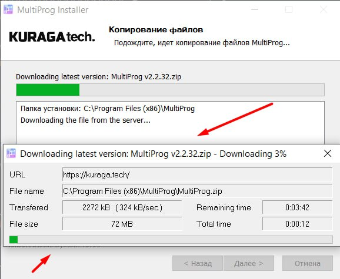

# Владислав Фёдоров (Software Engineer / R&D Developer)


**Возраст:** 25 лет (03.12.2000)  
**Telegram:** [@Barhatnoe_puzzo](https://t.me/Barhatnoe_puzzo) | **Email:** vladislav.fedorov.work@mail.ru

---

## 👨‍💻 Обо мне
Full-Stack R&D инженер-исследователь. Специализируюсь на создании сложных, нестандартных систем с нуля. Не ограничиваю себя конкретным стеком: решаю задачи от реверс-инжиниринга бинарных протоколов, управления железом (UDP/TCP) и управления Arduino-термостатами на крайнем севере до написания собственных 3D-движков на чистом OpenGL/GLSL и математического расчёта орбит спутников в космосе по их GNSS-данным.

Я люблю работать на стыке технологий, глубоко понимаю низкоуровневые механизмы работы памяти, графического конвейера и многопоточности. Работаю не только на уровне прикладного API, а регулярно  разбираюсь с тем, что находится под ним: с протоколами, форматами, потоками, памятью, производительностью и архитектурой. Легко адаптируюсь к новым технологиям, готов погружаться в различные языки программирования и хорошо нахожу общий язык с другими людьми. Хотел бы попробовать себя также в сфере GameDev, VR, Computer Vision, DeepTech и сложной алгоритмики.

---

## 🎓 Образование
**Белорусский национальный технический университет (БНТУ)**  
*Инженер-программист, Факультет информационных технологий и робототехники (ФИТР) (2018 — 2022)*  
**Дипломная работа:** Использование генетических алгоритмов для проектирования 3D-изделий.

---

## 🛠 Ключевые навыки
- **Языки:** Python (Advanced), C++ (Intermediate), C, C#, Java, JavaScript, SQL, Lua, Assembly (чтение).
- **Desktop:** Qt/QML, Windows Forms, Tkinter.
- **3D-Графика:** OpenGL (ModernGL), GLSL (кастомные шейдеры), 3D-математика (векторы, матрицы, кватернионы), Level of Detail (LOD), Frustum Culling, Unity3D, Godot.
- **Алгоритмы:** Генетические и эволюционные алгоритмы (ГА), теория графов (DFS/BFS/Дейкстра/А*), машинное обучение (Scikit-learn), Computer Vision (OpenCV), нейросети.
- **Оптимизация:** Многопоточность (Race Conditions, Locks, asyncio), JIT-компиляция (Numba), NumPy, профайлинг.
- **Low-Level & Hardware / Железо:** Анализ бинарных данных, байтовый парсинг, дизассемблирование (Ghidra, IDA), сетевые протоколы (UDP/TCP), сниффинг (Wireshark), WinAPI, Arduino, WiFi-ESP32/ESP8266, Raspberry Pi.
- **Build / distribution:** PyInstaller, NSIS, .exe, подписывание сертификатов, работа с реестром и URL schemes.
- **Автоматизация:** Selenium, requests, Appium, Tasker, ADB, Power Automate, Telegram bots.
- **Знание английского:** B2 (хороший Listening и средний Speaking Skills).

---


## 💼 Опыт работы

### Freelance / Independent R&D Software Engineer
*Июль 2022 — Настоящее время*  
Реализовал порядка 50 проектов, из которых более 30 - комплексные наукоемкие B2B-проекты полного цикла: от проектирования архитектуры до релиза.

#### 1. Компьютерная графика и разработка 3D-движков
* **EarthStream 3D Engine (Python, OpenGL 3.3 Core, GLSL, PyQt5, NumPy):** 
  Спроектировал кастомный 3D-движок для потокового рендеринга реальной топографии Земли (DEM-карты).
  * *Архитектура:* Многопоточный пайплайн загрузки геоданных с жесткой изоляцией потоков UI и рендера.
  * *Оптимизация:* Алгоритм честного бесшовного сшивания геометрии в RAM (устранение T-junctions). Векторный Frustum Culling и динамический LOD. Отрисовка миллионов полигонов при стабильных 60+ FPS.
  * *Шейдеры:* Генератор рельефа (Fractal Brownian Motion), Distance Fog, физика First-Person камеры с коллизиями.
  * *Управление:* Создан отдельный инструментарий разработчика для управления параметрами рендера без блокировки OpenGL-контекста.
  
  🎥🔦
  <details><summary>Сниппет кода математики сшивания</summary>

  ```python
    for chunk in self.active_chunks:
        cx, cz = chunk
  
        # Превращаем байты в 3D массив numpy (256x256 пикселей, 3 канала RGB)
        dem_bytes = self.chunk_textures[chunk]['dem'].read()
        dem_np = np.frombuffer(dem_bytes, dtype=np.uint8).reshape((256, 256, 3)).copy()
  
        # 1. Сшиваем с Левым соседом (cx-1)
        # Усредняем Левый край текущего (col 0) и Правый край соседа (col 255)
        if (cx - 1, cz) in self.dem_arrays:
            neigh = self.dem_arrays[(cx - 1, cz)]
            avg_edge = self._average_mapzen_edges(dem_np[:, 0, :], neigh[:, 255, :])
            dem_np[:, 0, :] = avg_edge
            neigh[:, 255, :] = avg_edge
            # Динамически обновляем текстуру соседа прямо в видеокарте
            if (cx - 1, cz) in self.chunk_textures and self.chunk_textures[(cx - 1, cz)] is not None:
                self.chunk_textures[(cx - 1, cz)]['dem'].write(neigh.tobytes())
  
        # 2. Сшиваем с Правым соседом (cx+1)
        ...
        # 3. Сшиваем с Верхним соседом (cz-1, Север)
        ...
        # 4. Сшиваем с Нижним соседом (cz+1, Юг)
        ...
  
        # --- СШИВАНИЕ УГЛОВ (вбиваем гвозди в диагонали) ---
        # Левый верхний (Северо-Запад NW)
        self._sync_corner([((cx, cz), 0, 0), ((cx, cz - 1), 255, 0),
                          ((cx - 1, cz), 0, 255), ((cx - 1, cz - 1), 255, 255)])
        # Левый нижний (Юго-Запад SW)
        ...
        # Правый верхний (Северо-Восток NE)
        ...
        # Правый нижний (Юго-Восток SE)
        ...
  
        # Сохраняем прошитый массив для будущих соседей
        self.dem_arrays[(cx, cz)] = dem_np
  
        # Обновляем байты для загрузки текущего чанка в GPU
        stitched_dem_bytes = dem_np.tobytes()
  ```
  </details>

#### 2. Reverse Engineering, Hardware и Низкоуровневая разработка
* **Управление опорно-поворотным устройством (ОПУ) по UDP:**
  Разработал асинхронное ПО (asyncio) с GUI для контроля позиционирования ОПУ.
  * *Сеть и данные:* Написал UDP-клиент для непрерывного обмена данными. Реализовал строгую валидацию бинарных пакетов (CRC) и побитовый разбор флагов состояния устройства.
    <details><summary>Сниппет кода с классом пакета для UDP передачи</summary>
    
    ```python
    # =====================================================================
    # БАЗОВЫЙ КЛАСС ПАКЕТА С ПОДДЕРЖКОЙ СRС
    # =====================================================================
    
    @dataclass
    class OpuPacket:
        """Базовый класс для сериализации структур ОПУ с расчетом побайтного CRC."""
        _FORMAT: ClassVar[str] = "<"
    
        def pack(self) -> bytes:
            """Упаковывает поля и автоматически рассчитывает и добавляет 2 байта CRC в конец."""
            values = [getattr(self, f.name) for f in fields(self)]
            # Упаковываем основные данные без контрольной суммы
            raw_payload = struct.pack(self._FORMAT, *values)
            # Считаем побайтную сумму данных всего пакета
            crc = self._calc_checksum(raw_payload)
            # Дописываем контрольную сумму (2 байта, Word)
            return raw_payload + struct.pack("<H", crc)
    
        @classmethod
        def unpack_payload(cls: Self, data: bytes) -> Tuple[Self, int]:
            """Распаковывает только полезную нагрузку структуры, валидируя CRC."""
            fmt = cls._FORMAT
            payload_size = struct.calcsize(fmt)
    
            if len(data) < payload_size + 2:
                raise ValueError(f"Размер пакета меньше минимального для {cls.__name__}")
    
            raw_payload = data[:payload_size]
            # NOTE: struct.unpack отдает кортеж (val,), поэтому берем [0]
            expected_crc = struct.unpack("<H", data[payload_size:payload_size + 2])[0]
    
            # Проверка контрольной суммы
            actual_crc = cls._calc_checksum(raw_payload)
            if actual_crc != expected_crc:
                raise ValueError(f"Ошибка CRC ОПУ: ожидалось {expected_crc}, получено {actual_crc}")
    
            unpacked_values = struct.unpack(fmt, raw_payload)
            init_fields = [f.name for f in fields(cls)]
    
            return cls(**dict(zip(init_fields, unpacked_values))), payload_size + 2
    
        @staticmethod
        def _calc_checksum(raw_payload: bytes):
            return sum(raw_payload) & 0xFFFF
    ```
    </details>

  * *Управление:* Спроектировал датаклассы для упаковки команд движения (азимут/угол места) и интегрировал плавное управление с клавиатуры.
* **Математика и парсинг сигналов GNSS (C, Python):**
  Реверс-инжиниринг протоколов китайского GNSS-приемника. Побайтовый парсинг сырых RTCM-пакетов. Модификация чужой C-библиотеки `RTKLIB` (перестройка метода наименьших квадратов) для расчета точных координат по эфемеридам спутников.
* **Анализатор телеметрии БИНС (C++, Windows Forms):**
  Десктопное ПО для побайтового парсинга сырых `.ms`-файлов Бесплатформенной Инерциальной Навигационной Системы и визуализации графиков. Реализованы фильтры данных, таблицы, гистограммы и графики по выбранным параметрам.
*  **Reverse  и Legacy:** Опыт дизассемблирования закрытого старого ПО (Delphi, Unity) через Ghidra/IDA Pro, анализ сетевого трафика, работа с недокументированными Windows API.

#### 3. Эволюционные алгоритмы и Моделирование
* **Топологическая оптимизация деталей (Python, API Ansys Mechanical):**
  Разработал комплекс для 3D-печати. Использовал ГА для генерации оптимальных ячеистых структур на основе вектора физических нагрузок. Также отдельным проектом автоматизировал научный цикл тестирования нового материала.
* **Симуляция эволюции клеточных автоматов (C++, SFML):**
  Производительная симуляция клеточной жизни (питаются, размножаются, передают гены) с механизмами мутации ДНК. Перевод проекта с Python на C++ для ускорения расчетов в 20 раз.

🎥🔦

* **Многомерная алгоритмическая оптимизация:**
  Использование ГА для решения NP-трудных задач: планирование рабочих графиков в 23000-мерном пространстве (ГА + Numba); автоматическая 3D-расстановка объектов мебели с обходом коллизий многоугольников; покупка выгодных бинарных опционов.

🎥🔦

#### 4. GIS-системы и Desktop
* **Классификация:**
  Разработка ГИС-приложений на базе QGIS (PyQt5) для классификации участков земли со спутников (Scikit-learn), с применением алгоритмов фильтрации матриц изображений (Numpy). 
  * Реализованы зум, панорамирование, координаты, работа со слоями, измерения и Drag&Drop из файловой системы и дерева слоёв.
  * Фильтрация растровых изображений, создание классов обучающей выборки, разметка и поиск схожих участков.

* **Отдельная ветка GIS-разработки:** 
  Работа с онлайн картами, вычисление геометрической видимости по цифровой модели рельефа (оптимизированная трассировка лучей). Интеграция с реальными магнитометрами.
  * На тестовых массивах размером порядка 4608 x 4608 вычисление после оптимизации занимало секунды вместо десятков секунд.
  * В софте присутствуют: ПКМ меню, тулбар, многопоточный код, сборка ".exe", установщик и сертификаты.

  <details><summary>Сниппет кода с jit компиляцией для расчёта горизонта</summary>
  
  ```python
  
  @njit(cache=True, fastmath=True, parallel=True)
  def process_all_rays_numba(effective_height, visible, edge_points, cx, cy, center_height, pixel_size):
      """
      Выполняет расчёт видимости по всем лучам DEM.
  
      Алгоритм:
  
      1. Для каждой точки периметра строится DDA-луч.
      2. Луч проходит через DEM с субпиксельной точностью.
      3. Высота рельефа вычисляется билинейной интерполяцией.
      4. Для каждой точки вычисляется угол возвышения.
      5. Поддерживается текущий радиогоризонт (максимальный угол вдоль луча).
      6. Точка считается видимой, если её угол не ниже текущего горизонта.
  
      Все лучи обрабатываются внутри одной Numba-функции,
      что исключает тысячи переходов Python → Numba.
  
      parallel=True позволяет распределять лучи между
      несколькими ядрами CPU.
      """
  
      h_map, w_map = effective_height.shape
      num_rays = edge_points.shape[0]
  
      for ray_idx in prange(num_rays):
          # ============================================================
          # DDA (Digital Differential Analyzer)
          # ============================================================
          # Строим дискретный луч от центра к граничной точке.
          x1, y1 = edge_points[ray_idx, 0], edge_points[ray_idx, 1]
          dx, dy = x1 - cx, y1 - cy
  
          # Шаг выбирается по максимальной компоненте, чтобы за одну итерацию не перепрыгнуть пиксель вдоль главной оси движения.
          steps = max(abs(dx), abs(dy))
  
          if steps == 0:
              continue
  
          # Двигаемся маленькими шагами вдоль направления луча и сохраняем все пересечённые пиксели.
          step_x, step_y = dx / steps, dy / steps
          ray_step_length = math.sqrt(step_x * step_x + step_y * step_y)
  
          # Текущий радиогоризонт.
          # Храним максимальный угол возвышения, встретившийся вдоль луча.
          # Любая последующая точка с меньшим углом считается скрытой рельефом.
          max_angle = -1e30
          for i in range(steps + 1):
              x, y = cx + step_x * i, cy + step_y * i
  
              ix, iy = int(x), int(y)
  
              # Bilinear interpolation значительно уменьшает ступенчатые эффекты DEM.
              x0, y0 = ix, iy
  
              x1i, y1i = min(x0 + 1, w_map - 1), min(y0 + 1, h_map - 1)
  
              fx, fy = x - x0, y - y0
  
              h00 = effective_height[y0, x0]
              h10 = effective_height[y0, x1i]
              h01 = effective_height[y1i, x0]
              h11 = effective_height[y1i, x1i]
  
              # Получаем высоту рельефа в дробных координатах луча.
              height = (
                      h00 * (1.0 - fx) * (1.0 - fy)
                      + h10 * fx * (1.0 - fy)
                      + h01 * (1.0 - fx) * fy
                      + h11 * fx * fy
              )
  
              # Дистанция до луча
              distance = 1e-9 if i == 0 else (i * ray_step_length * pixel_size)
  
              # Угол возвышения
              # Сам угол через atan() не нужен, поскольку для сравнения видимости достаточно относительного порядка значений.
              # Это быстрее и даёт тот же результат.
              angle = ((height - center_height) / distance)
  
              # ===== Построение горизонта =====
              # Идея алгоритма видимости:
              # Для каждой точки луча запоминаем максимальный угол возвышения, встреченный ранее на этом луче.
              # Если текущий угол меньше уже существующего горизонта, значит объект закрыт более высоким препятствием.
              
              if angle >= max_angle:
                  # Одновременно обновляем горизонт.
                  max_angle = angle
                  # Видимыми будут только точки, которые больше или равны текущему горизонту.
                  visible[iy, ix] = 1
  ```
  </details>

* **Множество Desktop .exe приложений:**
  С самоподписанными сертификатами безопасности, полноценными легковесными установщиками (качающими сам софт по сети), многопоточные, с различными анимациями, экранами, виджетами и прочей вёрсткой.

📸🔦

#### 5. Системная автоматизация и сетевой код
* **Расчёт краски для флексографической CMYK печати:** 
Полная автоматизация программы CorelDraw с помощью Windows API. Многоэтапная подготовка “.cdr” проекта к печати и просчёт затрат краски на изделие.

* **Приложение для автоматизации Desktop-мессенджера без официального
бизнес-API:** 
Считывание HWND и анализ интерфейса через дерево объектов окна. Дополнительный попиксельный анализ рабочей области для более точного выделения элементов. Получение/отправка сообщений, включая медиафайлы, JSON-выгрузка, логирование, настройки и длительная работа.

* **Автоматизация сайтов и API:**
За годы контрактной разработки несколько систем строились вокруг прямого взаимодействия с веб-сервисами, а не только браузерной автоматизации.
   * Сырые POST/GET-запросы к сайтам и внутренним API, анализ сетевого поведения и
   переход от Selenium к прямым запросам там, где это было возможно.
   * Долгоживущие многопоточные парсеры с логированием, кэшированием, обработкой
   ошибок и уведомлениями в Telegram.
   * Примеры: панели автоматизации, парсер книжных каталогов, Google Sheets API,
   мониторинг сайтов, игровые и бизнес-боты.

* **Автоматизация смартфонов:**
Автоматизация физических Android-устройств и тестовых стендов.
  * ADB по Wi-Fi и USB, работа с файловой системой телефона, запуск приложений и
  эмуляция действий пользователя.
  * Запись сценариев на одном устройстве и воспроизведение на пуле устройств.
  * Проксирование трафика через gost, многопоточность, группы устройств, повторные
  запуски, логирование и сбор результатов.
